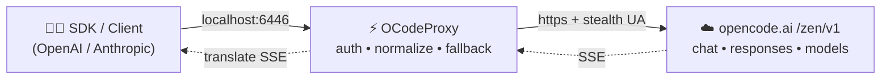

# ⚡ OCodeProxy

<p align="center">
  <strong>Clean, modern multi-protocol proxy for OpenCode Zen</strong>
  <br />
  <sub>OpenAI • Responses • Anthropic — one local endpoint, beautiful TUI, zero restarts.</sub>
</p>

<p align="center">
  <a href="https://nodejs.org/"></a>
  <a href="https://expressjs.com/"></a>
  
  
  
</p>

> **TL;DR:** Run `npm install && npm start`, point your `OPENAI_BASE_URL` to `http://localhost:6446/v1`, and use any OpenAI / Anthropic SDK as if it were native. 🔌

---

## 📑 Table of Contents

- [✨ Features](#-features)
- [🚀 Quick Start](#-quick-start)
- [⚙️ Configuration](#️-configuration)
- [🔑 Authentication](#-authentication)
- [📡 API Endpoints](#-api-endpoints)
- [💡 Usage Examples](#-usage-examples)
- [🖥️ Terminal UI](#️-terminal-ui)
- [🧠 How It Works](#-how-it-works)
- [📁 Project Structure](#-project-structure)
- [🧪 Testing](#-testing)
- [🛡️ Security Notes](#️-security-notes)
- [📝 License](#-license)

---

## ✨ Features

| Area | What you get |
|------|--------------|
| 🔀 **Multi-protocol** | `POST /v1/chat/completions` (OpenAI), `POST /v1/responses` (Responses API), `POST /v1/messages` + `count_tokens` (Anthropic) |
| 📦 **Model gateway** | `GET /v1/models`, `GET /v1/models/:id` with alias resolution, deprecation guard, and auto-refresh from upstream |
| 🔁 **Resilient** | Automatic model fallback (`FALLBACK_ATTEMPTS`), retry on retryable upstream errors, SSE aggregation for non-streaming clients |
| 🌊 **Streaming-first** | True pass-through SSE for all three protocols, with on-the-fly format translation |
| 🖥️ **Fancy TUI** | `boxen` banner, `clack` settings menu, color-coded request log via `picocolors` |
| 🔥 **Hot-swap** | Press `s` → pick a port → keep serving without killing the process |
| 🌐 **Egress proxy** | `SOCKS5 / HTTP(S)` upstream support, persisted to `proxy-config.json` |
| 🔑 **Local auth** | File-based keys with `timingSafeEqual`, masked display, per-user sessions |
| 🕵️ **Stealth headers** | Realistic `opencode/... ai-sdk/... bun/...` User-Agent with periodic auto-update |

### Request log format

```text
[HH:MM:SS] METHOD path STATUS_CODE durationms
```

Status colors: <font color="green">2xx green</font> · <font color="cyan">3xx cyan</font> · <font color="yellow">4xx yellow</font> · <font color="red">5xx red</font>

---

## 🚀 Quick Start

### 1️⃣ Prerequisites

- Node.js `>= 18`
- npm (or pnpm / yarn / bun — your call)

### 2️⃣ Install & run

```bash
# install dependencies
npm install

# start the proxy (default http://localhost:6446)
npm start

# dev mode with auto-reload
npm run dev
```

### 3️⃣ Point any client at it

```bash
export OPENAI_BASE_URL="http://localhost:6446/v1"
export OPENAI_API_KEY="<one-key-from-api-keys.json>"

curl "$OPENAI_BASE_URL/models" \
  -H "Authorization: Bearer $OPENAI_API_KEY"
```

<details>
<summary><strong>🐳 One-liner health check</strong></summary>

```bash
curl -s http://localhost:6446/health | python3 -m json.tool
```

Expected:

```json
{
  "status": "ok",
  "version": "v0.1.0-t1",
  "port": 6446,
  "models": 42,
  "endpoints": ["/health", "/v1/models", "/v1/chat/completions", "/v1/responses", "/v1/messages", "/v1/messages/count_tokens"]
}
```

</details>

---

## ⚙️ Configuration

Priority: `CLI flag` > `env var` > `default`.

### CLI

```bash
node server.mjs -p 8080
node server.mjs --port 8080
```

### Environment variables

| Variable | Default | Description |
|----------|---------|-------------|
| `PROXY_PORT` | `6446` | Listening port |
| `KEYS_FILE` | `./api-keys.json` | Where local API keys live (auto-created, `0600`) |
| `MODELS_FILE` | `./models.json` | Cached model list |
| `PROXY_CONFIG_FILE` | `./proxy-config.json` | Persisted upstream proxy URL |
| `UPSTREAM_PROXY` / `ALL_PROXY` / `HTTPS_PROXY` | `""` | Egress proxy, e.g. `socks5://127.0.0.1:1080` |
| `ZEN_AUTH_MODE` | `public` | Upstream Zen auth mode |
| `FALLBACK_ATTEMPTS` | `3` | How many models to try in fallback chain (`1–10`) |
| `FALLBACK_DELAY_MS` | `300` | Delay between fallbacks (`0–10000`) |
| `OC_VERSION` | auto | Pinned `opencode/x.y.z` UA version (auto-updates every 6h) |
| `PROXY_VERSION` | `16` | Shown in `/health` as `proxy_version` |
| `AI_SDK_VER` / `BUN_VER` | `4.0.23` / `1.3.13` | UA fingerprint parts |
| `OPENCODE_CLIENT` / `OPENCODE_PROJECT` | `cli` / `global` | `x-opencode-*` headers |

> [!TIP]
> All fingerprint values can be overridden to match your real OpenCode install if upstream starts filtering.

> [!NOTE]
> `template/` is a standalone starter project and is git-ignored. Copy it out if you want a minimal client example.

---

## 🔑 Authentication

Keys are stored in `api-keys.json` as `{ "name": "key" }`:

```jsonc
{
  "admin": "ocp_sk_...",
  "user-default": "ocp_sk_..."
}
```

Send it either way:

```bash
# Bearer style (OpenAI-compatible)
-H "Authorization: Bearer ocp_sk_..."

# raw key style
-H "x-api-key: ocp_sk_..."
```

Optional per-request Zen override:

```bash
-H "x-zen-key: <your-upstream-key>"
# alias: x-opencode-key
```

- [x] Constant-time comparison (`crypto.timingSafeEqual`)
- [x] Corrupt file → auto-backup to `api-keys.json.corrupt-<ts>.bak` + regenerate
- [x] Manage keys live via Settings → `Generate / Regenerate / View`

---

## 📡 API Endpoints

| Method | Path | Auth | Description |
|--------|------|------|-------------|
| `GET` | `/` | no | Server info + endpoint list |
| `GET` | `/health` | no | Status, version, port, model count, proxy flag |
| `GET` | `/v1/models` | yes | OpenAI-style model list |
| `GET` | `/v1/models/:id` | yes | Single model, `404` if unknown / discontinued |
| `POST` | `/v1/chat/completions` | yes | Chat completions, `stream: true/false` |
| `POST` | `/v1/responses` | yes | Responses API, `stream: true/false` |
| `POST` | `/v1/messages` | yes | Anthropic Messages, `stream: true/false` |
| `POST` | `/v1/messages/count_tokens` | yes | Anthropic token estimation |

All responses include `x-zen-served-by: ocodeproxy`.

Error shape follows the protocol you called:

- OpenAI → `{ error: { message, type, code } }`
- Anthropic → `{ type: "error", error: { type, message } }`

---

## 💡 Usage Examples

### OpenAI Chat (stream)

```bash
curl -N http://localhost:6446/v1/chat/completions \
  -H "Authorization: Bearer $OPENAI_API_KEY" \
  -H "Content-Type: application/json" \
  -d '{
    "model": "muse-spark",
    "messages": [{ "role": "user", "content": "Hello from OCodeProxy!" }],
    "stream": true
  }'
```

### OpenAI Chat (non-stream, with tools)

```python
from openai import OpenAI

client = OpenAI(base_url="http://localhost:6446/v1", api_key="ocp_sk_...")
resp = client.chat.completions.create(
    model="muse-spark",
    messages=[{"role": "user", "content": "What time is it?"}],
    tools=[{
        "type": "function",
        "function": {
            "name": "get_time",
            "description": "Get current time",
            "parameters": {"type": "object", "properties": {}}
        }
    }],
)
print(resp.choices[0].message)
```

### Anthropic Messages

```bash
curl -N http://localhost:6446/v1/messages \
  -H "x-api-key: $OPENAI_API_KEY" \
  -H "anthropic-version: 2023-06-01" \
  -H "Content-Type: application/json" \
  -d '{
    "model": "muse-spark",
    "max_tokens": 256,
    "messages": [{ "role": "user", "content": "Translate to French: hello world" }]
  }'
```

### Responses API

```javascript
const res = await fetch("http://localhost:6446/v1/responses", {
  method: "POST",
  headers: {
    "Authorization": `Bearer ${process.env.OPENAI_API_KEY}`,
    "Content-Type": "application/json"
  },
  body: JSON.stringify({
    model: "muse-spark",
    input: "Summarize OCodeProxy in one sentence.",
    stream: false
  })
});
console.log(await res.json());
```

---

## 🖥️ Terminal UI

On boot you get a `boxen` status card:

```text
╭────────────────────────────────────────╮
│  ⚡ OCodeProxy v0.1.0-t1               │
│  Status:   ● ONLINE                    │
│  Local:    http://localhost:6446       │
│  Endpoints: ...                        │
│  Controls: [s] Settings  [q] Stop      │
╰────────────────────────────────────────╯
```

| Key | Action |
|-----|--------|
| `s` / `p` | ⚙️ Open Settings (port, proxy, UA version, models, keys) |
| `q` or `Ctrl+C` | 🚪 Graceful shutdown |

Settings menu lets you without restart:

1. 🔁 Change / hot-swap port (with `isPortAvailable` check)
2. 🌐 Set / clear outbound proxy (`socks5://`, `http://`…)
3. 🕵️ Check & update OpenCode UA version
4. 📦 Refresh / view models from upstream Zen
5. 🔑 Generate new key, regenerate defaults, view masked keys

> [!IMPORTANT]
> Prompts auto-disable when `stdin` is not a TTY (CI, Docker, `-p` background jobs), so logs stay clean.

---

## 🧠 How It Works



- **Normalization:** `lib/convert.mjs` converts between Chat ↔ Responses ↔ Anthropic, injects fingerprint tools, ensures assistant reasoning blocks.
- **Routing:** `lib/models.mjs` resolves aliases, filters discontinued models, partitions `chat` vs `muse-spark* responses` models.
- **Fallback:** `lib/fallback.mjs` builds `candidateModels(target)` → tries up to `FALLBACK_ATTEMPTS` with streaming-aware retry (`tryStreamFallback` vs `collectWithFallback`).
- **Errors:** `lib/errors.mjs` maps Zen errors to OpenAI / Anthropic shapes, hides raw network details behind safe messages.
- **IDs/keys:** `lib/ids.mjs` (`ses_*`, `msg_*`, …) + `lib/keys.mjs` (generation, masking, validation).

---

## 📁 Project Structure

```text
OCodeProxy/
├── 🧠 server.mjs          # express app, TUI, hot-swap, all /v1 routes
├── 📚 lib/
│   ├── convert.mjs        # chat ⇄ responses ⇄ anthropic converters
│   ├── models.mjs         # discovery, alias, fallback list
│   ├── errors.mjs         # upstream error mapping
│   ├── fallback.mjs       # collect / stream fallback orchestration
│   ├── keys.mjs           # key gen / mask / validate
│   ├── ids.mjs            # ocId() session/message ids
│   └── content.mjs        # content helpers + token estimate
├── 🧪 test/               # node:test suites (convert, errors, models…)
├── 🚀 package.json        # scripts: start / dev / test
└── 🙈 .gitignore          # node_modules, template/, secrets, AGENTS.md
```

Useful scripts:

```bash
npm start   # production
npm run dev # node --watch
npm test    # node --test test/*.test.mjs
```

---

## 🧪 Testing

```bash
npm test
```

| Suite | Covers |
|-------|--------|
| `convert.test.mjs` | message / tool translation |
| `responses.test.mjs` | Responses API aggregation |
| `models.test.mjs` | alias + deprecation + fallback |
| `errors.test.mjs` | Zen → OpenAI / Anthropic mapping |
| `fallback.test.mjs` | retry orchestration |
| `ids-keys.test.mjs` | id format, key validation |
| `sampling.test.mjs` | sampling / conversion edge cases |

> [!CAUTION]
> Never commit real keys: `api-keys.json`, `models.json`, `proxy-config.json` and `.env` are git-ignored by design.

---

## 🛡️ Security Notes

- Keys file is written with `0600` and atomically via `.tmp` + rename.
- Auth uses constant-time compare to avoid timing leaks.
- Body limit `10mb`, strict JSON error handling (`413` / `400` with protocol-correct shape).
- Upstream network errors are sanitized via `publicNetworkMessage()` — no internal IPs / stacks leak to clients.

---

## 📝 License

MIT — do whatever, just keep the header. 💛

<p align="center">
  <sub>Built with ❤️ on Express + Clack + Boxen + PicoColors.<br/>If it saves you a restart, give it a ⭐.</sub>
</p>
